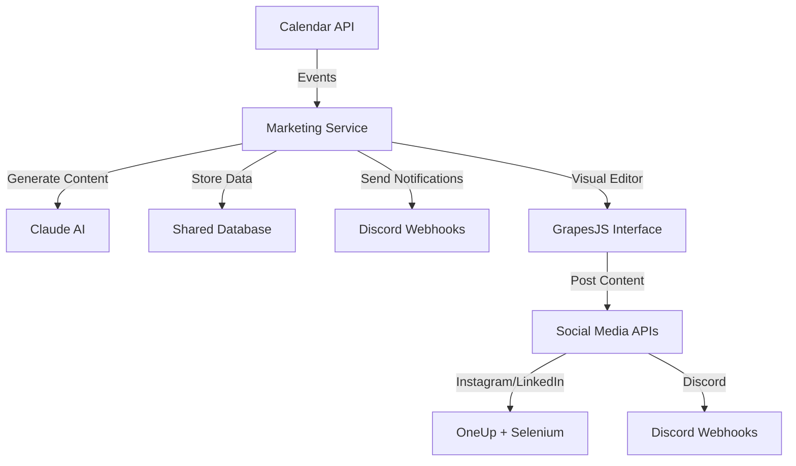

# RYAN - SoDA Marketing Automation Bot

## Overview

Marketing faces frequent workflow issues with regard to last-minute posting, inconsistent copywriting and visual design, and unnecessary effort on repetitive tasks like filling in pre-made templates from event calendar information.

RYAN is an automated system built to streamline SoDA's event marketing workflow by generating social media content, managing cross-platform posting, and scheduling reminders.

This solution reduces manual effort from the marketing team on tedious tasks (freeing them to pursue more creative efforts) while maintaining consistent branding across platforms.

## Latest Updates (August 2025)

* **Module Integration**: Fully integrated into the SoDA Internal API as a proper module
* **Database Integration**: Now uses the shared SQLAlchemy database instead of separate SQLite/JSON files
* **Service Architecture**: Implemented proper service layer following the codebase patterns
* **Migration Support**: Added database migrations for marketing tables
* **Improved API**: Refactored API endpoints to use the service layer
* **Shared Resources**: Uses shared configuration, logging, and database connections

## Architecture

The marketing module follows the standard SoDA Internal API module pattern:

```
modules/marketing/
├── api.py              # Flask Blueprint with API endpoints
├── models.py           # SQLAlchemy database models
├── service.py          # Business logic and service layer
├── claude.py           # Claude AI integration for content generation
├── selenium.py         # Selenium automation for social media posting
├── events.py           # Event data fetching from calendar API
├── message.py          # Discord notification handling
├── template.py         # HTML template generation
├── editable_link.py    # Server URL utilities
└── README.md          # This file
```

### Database Models

- **MarketingEvent**: Stores event information and generated content
- **MarketingConfig**: Configuration settings for the marketing module
- **MarketingLog**: Activity logging for tracking operations

### Key Components

1. **MarketingService**: Main service class that handles:
   - Event monitoring and content generation
   - Database operations for marketing events
   - Activity logging and configuration management

2. **API Blueprint**: RESTful endpoints for:
   - Dashboard and event management
   - Content editing and viewing
   - Social media posting
   - Monitoring controls

3. **Database Integration**: Uses the shared SQLAlchemy setup with:
   - Automatic table creation via migrations
   - Shared database connection pooling
   - Consistent transaction handling

## Goals / Objectives

* Automate event information gathering and content generation
* Create and schedule posts across multiple platforms (Instagram, LinkedIn, Discord, Email)
* Generate graphics with AI while both using existing templates and keeping humans in the loop
* Maintain consistent timing for event promotions, preventing last-minute posting
* Reduce manual workload for marketing team
* Integrate seamlessly with the SoDA Internal API ecosystem

## Non-goals / Out of Scope

* Using diffusion models to create wholly AI-generated images
* Creating a Discord bot (webhooks for notifications will suffice)
* Maintaining separate database instances (now uses shared database)

## Requirements

### Functional Requirements

* Monitor `/events` endpoint in T'NAY API for new events one week into the future
* Generate Content Package
   * Platform-specific content:
      * Short-form for Instagram (with hashtags)
      * Professional copy for LinkedIn
      * Long-form for Discord and email
   * Graphics in multiple formats:
      * Landscape (1300x780px) for Email
      * Square (1080x1080px) for social media platforms
* Implement webhook-based notification system for marketing team via Discord
* Enable visual editing of AI-generated graphics through GrapesJS
* Automate cross-posting to:
   * Instagram, LinkedIn (via OneUp API with Selenium)
   * Discord (via webhooks)
   * Email (planned future integration)

### Technical Requirements

* Use shared SQLAlchemy database for data persistence
* Follow SoDA Internal API module patterns and conventions
* Integrate with shared configuration and logging systems
* Provide database migrations for schema changes
* Use the service layer pattern for business logic

## Installation & Setup

### Prerequisites

The marketing module is part of the SoDA Internal API and inherits its dependencies. Ensure you have:

- Python 3.8+
- SQLAlchemy (shared database)
- Flask (shared web framework)
- Required API keys (see Configuration)

### Database Setup

The marketing module automatically creates its database tables through the migration system:

```bash
# Run all migrations (including marketing)
python3 -c "from migrations import run_all_migrations; run_all_migrations()"
```

This creates the following tables:
- `marketing_events`: Event data and generated content
- `marketing_config`: Configuration settings
- `marketing_logs`: Activity and error logging

### Configuration

The module uses the shared configuration system. Ensure these environment variables are set:

```bash
# Required for content generation
OPEN_ROUTER_CLAUDE_API_KEY=your_claude_api_key

# Required for Discord notifications
DISCORD_OFFICER_WEBHOOK_URL=your_discord_webhook_url
DISCORD_POST_WEBHOOK_URL=your_discord_post_webhook_url

# Required for social media posting
ONEUP_EMAIL=your_oneup_email
ONEUP_PASSWORD=your_oneup_password

# Required for event monitoring
TNAY_API_URL=your_tnay_api_url
```

### Usage

The marketing module is automatically registered as a Blueprint in the main application:

```python
# In main.py
from modules.marketing.api import marketing_blueprint
app.register_blueprint(marketing_blueprint, url_prefix="/marketing")
```

Access the marketing dashboard at: `http://localhost:5000/marketing/`

## API Endpoints

### Dashboard & Management
- `GET /marketing/` - Main dashboard with event overview
- `GET /marketing/status` - Get monitoring status
- `POST /marketing/toggle-monitoring` - Toggle automatic monitoring
- `POST /marketing/process-events-now` - Manually trigger event processing

### Event Management
- `GET /marketing/events/<event_id>` - Event editor interface
- `POST /marketing/events/<event_id>/update-content` - Update event content
- `POST /marketing/events/<event_id>/save-image` - Save generated image
- `POST /marketing/events/<event_id>/post-to-discord` - Post to Discord
- `POST /marketing/events/<event_id>/post-to-socials` - Post to social media

### Content Management
- `GET /marketing/view/<event_id>` - View-only event design
- `GET /marketing/load-content` - Load current editor content
- `POST /marketing/update-content` - Update editor content

## Service Layer

The `MarketingService` class provides the core business logic:

```python
from modules.marketing.service import MarketingService

# Get service instance (usually from Flask app context)
marketing_service = current_app.marketing_service

# Core operations
events = marketing_service.get_all_events()
event = marketing_service.get_event_by_id(event_id)
marketing_service.save_event(event_data)
marketing_service.mark_event_completed(event_id)

# Monitoring and content generation
marketing_service.monitor_events()
marketing_service.generate_event_content(event_id, event_data)

# Configuration and logging
marketing_service.set_config(key, value)
marketing_service.log_activity(event_id, action, status)
```

## How to Use

### Dashboard

Access the dashboard at `/marketing/` to:

* View all upcoming and completed events
* Toggle automatic event monitoring
* Manually trigger event processing

### Event Editor

For each event, access the editor at `/marketing/events/<event_id>` to:

* Edit the generated banner design
* Save changes to the database
* Export as HTML or image
* Post directly to Discord
* Post to Instagram and LinkedIn via OneUp

## Social Media Integration

The system now features direct posting to social media platforms:

1. Users can click "Send to Socials" after editing a banner
2. The system captures the banner as an image
3. Selenium automation logs into OneUp
4. The image and AI-generated caption are uploaded
5. The post is scheduled for both Instagram and LinkedIn
6. Event is marked as completed in the database

## Workflow

The marketing automation follows this workflow:

1. **Event Detection**: RYAN monitors the calendar API for events within a one-week window
2. **Content Generation**: AI generates platform-specific content and visual designs
3. **Notification**: Discord notification sent to marketing team with preview
4. **Review & Edit**: Marketing team can edit content and visuals through the web interface
5. **Publishing**: One-click posting to multiple platforms:
   - Discord (direct via webhook)
   - Instagram/LinkedIn (via OneUp using Selenium)
6. **Tracking**: All activities are logged for analytics and debugging

## Technical Architecture

The marketing module integrates with the SoDA Internal API ecosystem:



## Module Files

- **`api.py`**: Flask Blueprint with all HTTP endpoints
- **`models.py`**: SQLAlchemy database models for events, config, and logs
- **`service.py`**: Business logic layer for event management and automation
- **`claude.py`**: Claude AI integration for content and graphics generation
- **`selenium.py`**: Social media automation via OneUp platform
- **`events.py`**: Event data fetching from calendar API
- **`message.py`**: Discord notification handling
- **`template.py`**: HTML/CSS templates for the web interface
- **`editable_link.py`**: Server URL utilities for editor links

## Development

### Adding New Features

When extending the marketing module:

1. **Database Changes**: Add migrations in `migrations/marketing/`
2. **API Endpoints**: Add routes to `api.py` following REST conventions
3. **Business Logic**: Implement in `service.py` using the service pattern
4. **Models**: Add/modify SQLAlchemy models in `models.py`

### Testing

The module integrates with the shared testing infrastructure:

```bash
# Run marketing-specific tests
python -m pytest tests/marketing/

# Run all tests including marketing
python -m pytest
```

## Future Enhancements

* Email marketing integration
* Advanced analytics on post performance
* Image diffusion model integration for more varied visuals
* More granular scheduling options for multi-phase promotion
* Integration with additional social media platforms
* A/B testing for content optimization


# Marketing Module Integration Summary

## What Was Done

### 1. **Database Integration**
- Created SQLAlchemy models (`models.py`) that integrate with the shared database
- Replaced the custom SQLite/JSON database with shared database connection
- Added proper foreign key relationships and migrations

### 2. **Service Layer Implementation**
- Created `MarketingService` class (`service.py`) following the codebase patterns
- Moved all business logic from API controllers to the service layer
- Implemented proper error handling and logging

### 3. **Database Migrations**
- Added migration file (`migrations/marketing/__init__.py`)
- Automatically creates marketing tables: `marketing_events`, `marketing_config`, `marketing_logs`
- Includes default configuration setup

### 4. **API Refactoring**
- Updated `api.py` to use the service layer instead of direct database calls
- Maintained all existing endpoints for backward compatibility
- Added proper error handling and Flask app context usage

### 5. **File Cleanup**
- Removed unnecessary backup files and old database implementation
- Cleaned up `__pycache__` directories
- Updated README.md with new architecture documentation

## Key Benefits

1. **Consistency**: Now follows the same patterns as other modules (calendar, points, etc.)
2. **Shared Resources**: Uses the same database connection, configuration, and logging
3. **Maintainability**: Service layer makes business logic testable and reusable
4. **Scalability**: Proper database schema with migrations for future changes
5. **Integration**: Seamlessly integrates with the existing SoDA Internal API ecosystem

## Files Structure

```
modules/marketing/
├── api.py              # Flask Blueprint (updated to use service)
├── models.py           # SQLAlchemy models (NEW)
├── service.py          # Business logic service (NEW)
├── claude.py           # AI content generation
├── selenium.py         # Social media automation
├── events.py           # Event fetching
├── message.py          # Discord notifications
├── template.py         # HTML templates
├── editable_link.py    # Utility functions
└── README.md           # Updated documentation
```

## Next Steps

1. Run migrations to create the database tables
2. Test the API endpoints to ensure they work with the new service layer
3. Monitor the application logs for any integration issues
4. Consider adding unit tests for the service layer
