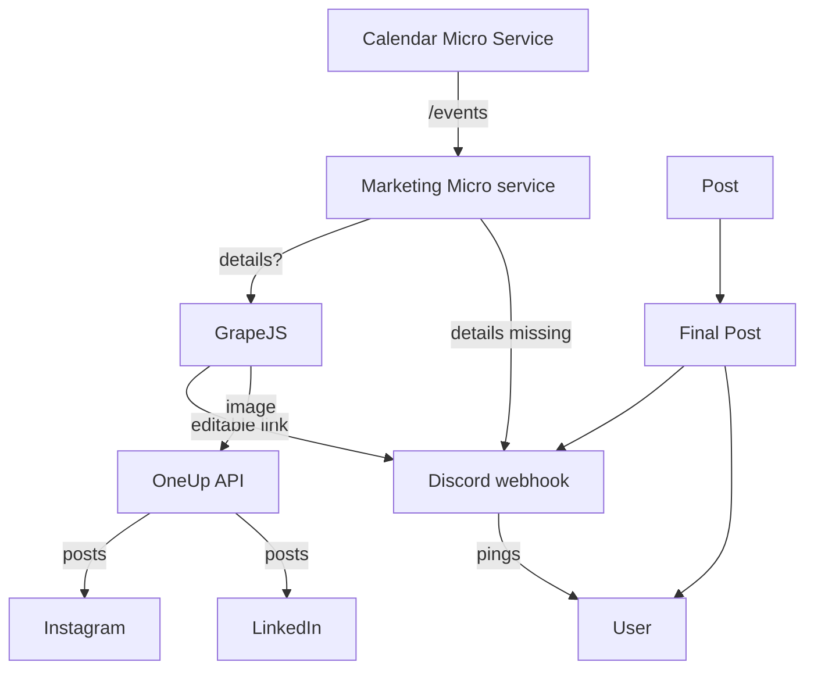
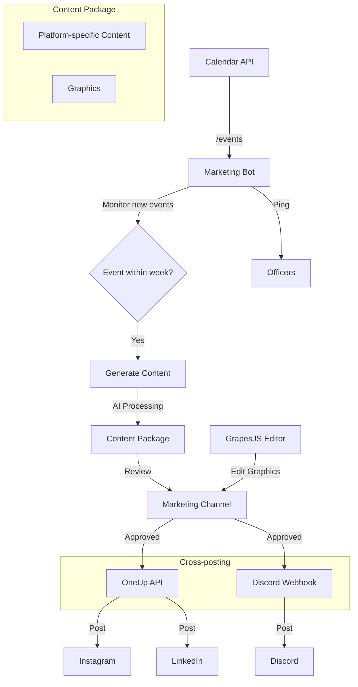

# RYAN - SoDA Marketing Automation Bot

Marketing faces frequent workflow issues with regard to last-minute posting, inconsistent copywriting and visual design, and unnecessary effort on repetitive tasks like filling in pre-made templates from event calendar information.

RYAN is an automated system built to streamline SoDA's event marketing workflow by generating social media content, managing cross-platform posting, and scheduling reminders.

This solution reduces manual effort from the marketing team on tedious tasks (freeing them to pursue more creative efforts) while maintaining consistent branding across platforms.

Repository: [https://github.com/asusoda/soda-marketing-bot](https://github.com/asusoda/soda-marketing-bot)

## Goals / Objectives

* Automate event information gathering and content generation
* Create and schedule posts across multiple platforms (Instagram, LinkedIn, Discord, Email)
* Generate graphics with AI while both using existing templates and keeping humans in the loop
* Maintain consistent timing for event promotions, preventing last-minute posting
* Reduce manual workload for marketing team

## Non-goals / Out of Scope

* Using diffusion models to create wholly AI-generated images
* Creating a Discord bot (webhooks for notifications will suffice)

## Requirements

### Functional Requirements

* Monitor `/events` endpoint in T'NAY API for new events one week into the future
* Generate Content Package
  * Platform-specific content:
    * Short-form for Instagram (with hashtags)
    * Professional copy for LinkedIn
    * Long-form for Discord and email
  * Graphics in multiple formats:
    * Landscape (1300x780px) for Email
    * Square (1080x1080px) for social media platforms
* Implement webhook-based notification system for marketing team via Discord
* Enable visual editing of AI-generated graphics through GrapesJS
* Automate cross-posting to:
  * Instagram, LinkedIn (via OneUp API)
  * Discord (via webhooks)
  * Email (planned future integration)

### Non-functional Requirements

* Integration with existing TANAY API
* OneUp API integration for social media posting
* Secure webhook implementation for Discord

## Technical Architecture

* Microservice architecture with Flask web server
  * Configuration interface and dashboard
  * GrapesJS integration for visual editing
* Claude 3.7 Sonnet for HTML/CSS and content generation
* OneUp API integration for Instagram and LinkedIn posting
* Discord webhooks for team notifications and posts

## Workflow

1. RYAN detects new event within one-week window
2. Discord notification sent to Marketing
3. RYAN generates Content Package:
   * Platform-specific captions
   * Graphics in required formats
4. Content Package sent to marketing channel for review
5. Marketing can edit graphics through embedded editor
6. One-click posting to multiple platforms:
   * Discord (direct via webhook)
   * Instagram (via OneUp API)
   * LinkedIn (via OneUp API)

## Success Metrics

* Reduction in manual posting time
* Consistency in cross-platform posting
* Accuracy of AI-generated content
* Marketing team satisfaction with editing tools
* Timely delivery of all scheduled posts

## How it works

### Core Components

1. **Event Monitoring** (`get_events.py`)

   * Polls the T'NAY API for upcoming events within a 7-day window
   * Transforms API response data into a standard format
   * Filters out events outside the time window
   * Falls back to mock data when API is unavailable
2. **Content Generation** (`generate_body.py`)

   * Creates platform-specific content for each event
   * Generates Instagram captions, LinkedIn posts, and Discord messages
   * Uses Claude AI when available, or falls back to template-based generation
   * Formats dates and adapts messaging style to each platform
3. **Template Management** (`get_template.py`)

   * Provides HTML/CSS templates for different platforms
   * Contains base templates with placeholders for dynamic content
   * Offers platform-specific variations with appropriate dimensions and styling
4. **Code Generation** (`generate_code.py`)

   * Converts event data into GrapesJS-compatible HTML/CSS
   * Uses templates and AI to create visually appealing banners
   * Handles formatting of event titles, dates, and descriptions
   * Falls back to manual template filling when AI is unavailable
5. **GrapesJS Integration** (`get_editable_link.py`)

   * Pushes generated HTML/CSS to the GrapesJS server
   * Ensures the Flask server is running
   * Returns an editable link for the marketing team
   * Handles server communication errors gracefully
6. **Social Media Integration** (`send_message.py`)

   * Formats Discord messages with event details and editable links
   * Posts content to Instagram and LinkedIn via OneUp API
   * Sends notifications to Discord webhooks
   * Handles various platform-specific formats and requirements
7. **Orchestration** (`main.py`)

   * Coordinates the entire workflow between modules
   * Provides web interface for manual operations and monitoring
   * Processes events through the content generation pipeline
   * Exposes API endpoints for cross-platform posting

### Workflow Sequence

1. The bot checks for upcoming events (`get_upcoming_events()`)
2. For each event found, it:
   * Generates platform-specific content descriptions
   * Gets appropriate HTML/CSS templates
   * Creates visual banners by filling templates
   * Pushes the generated code to GrapesJS
   * Sends a notification to Discord with the editable link
3. The marketing team receives the notification and can:
   * Edit the design directly in the GrapesJS editor
   * Send the banner to Discord with a single click
   * Post the banner to Instagram with caption
   * Share the banner on LinkedIn with professional content

### Dependencies

* Flask: Runs the web server and GrapesJS editor
* Requests: Handles API communication
* Anthropic: Powers AI-based content generation
* html2canvas: Captures editor content for social media sharing
* dotenv: Manages environment variables for API keys and webhooks

### Deployment Model

The system uses a microservice architecture where:

* The main Flask application serves the editor interface and API endpoints
* Background processes monitor for new events
* Discord webhooks provide notification infrastructure
* OneUp API handles cross-posting to Instagram and LinkedIn
* All components communicate through standardized interfaces
