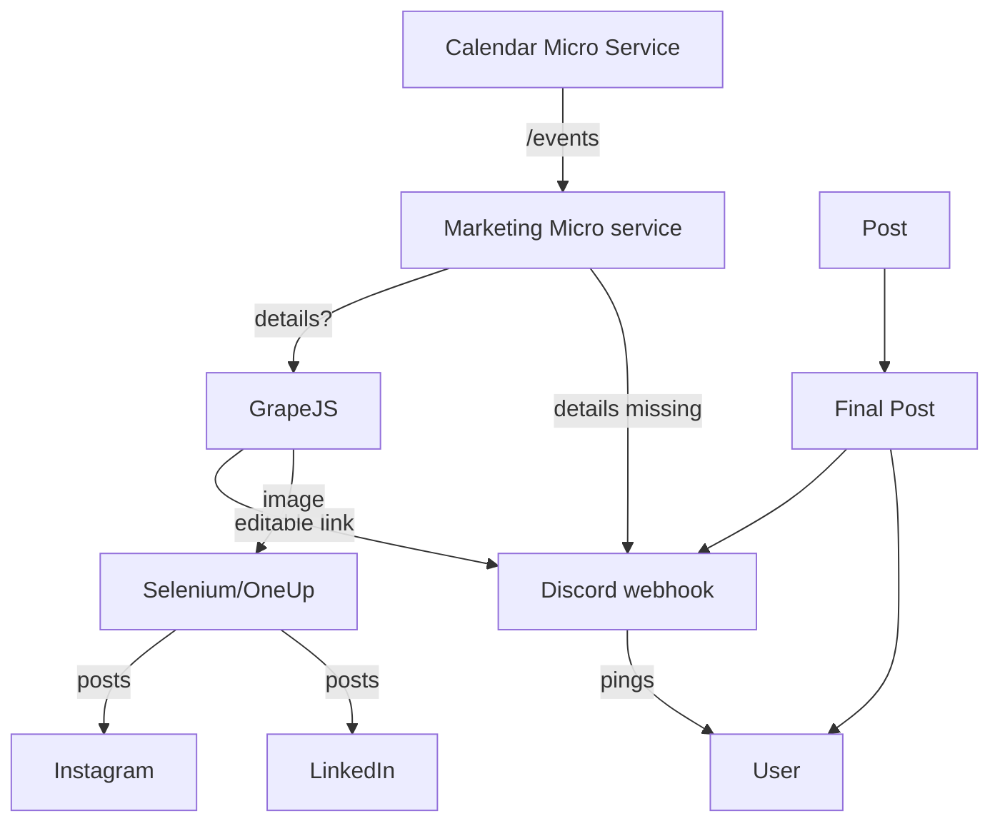

# RYAN - SoDA Marketing Automation Bot

## Overview

Marketing faces frequent workflow issues with regard to last-minute posting, inconsistent copywriting and visual design, and unnecessary effort on repetitive tasks like filling in pre-made templates from event calendar information.

RYAN is an automated system built to streamline SoDA's event marketing workflow by generating social media content, managing cross-platform posting, and scheduling reminders.

This solution reduces manual effort from the marketing team on tedious tasks (freeing them to pursue more creative efforts) while maintaining consistent branding across platforms.

## Latest Updates (May 2025)

* **Code Consolidation**: Merged `generate_body.py` and `generate_code.py` into a single `get_claude.py` module that handles all Claude AI interactions
* **Social Media Integration**: Added Selenium automation (`get_selenium.py`) to post directly to social media platforms via OneUp
* **API Improvements**: Enhanced API endpoints with proper error handling and improved user experience
* **Database Persistence**: Added better data storage with both JSON and SQLite options

## Goals / Objectives

* Automate event information gathering and content generation
* Create and schedule posts across multiple platforms (Instagram, LinkedIn, Discord, Email)
* Generate graphics with AI while both using existing templates and keeping humans in the loop
* Maintain consistent timing for event promotions, preventing last-minute posting
* Reduce manual workload for marketing team

## Non-goals / Out of Scope

* Using diffusion models to create wholly AI-generated images
* Creating a Discord bot (webhooks for notifications will suffice)

## Requirements

### Functional Requirements

* Monitor `/events` endpoint in T'NAY API for new events one week into the future
* Generate Content Package
   * Platform-specific content:
      * Short-form for Instagram (with hashtags)
      * Professional copy for LinkedIn
      * Long-form for Discord and email
   * Graphics in multiple formats:
      * Landscape (1300x780px) for Email
      * Square (1080x1080px) for social media platforms
* Implement webhook-based notification system for marketing team via Discord
* Enable visual editing of AI-generated graphics through GrapesJS
* Automate cross-posting to:
   * Instagram, LinkedIn (via OneUp API with Selenium)
   * Discord (via webhooks)
   * Email (planned future integration)

### Non-functional Requirements

* Integration with existing TANAY API
* OneUp API integration for social media posting via Selenium automation
* Secure webhook implementation for Discord
* Persistent event storage using database

## Technical Architecture

* Microservice architecture with Flask web server
   * Configuration interface and dashboard
   * GrapesJS integration for visual editing
* Claude 3.7 Sonnet for HTML/CSS and content generation
* Selenium automation for OneUp platform interaction
* Discord webhooks for team notifications and posts



## Workflow

1. RYAN detects new event within one-week window
2. Discord notification sent to Marketing
3. RYAN generates Content Package:
    - Platform-specific captions
    - Graphics in required formats
4. Content Package sent to marketing channel for review
5. Marketing can edit graphics through embedded editor
6. One-click posting to multiple platforms:
    - Discord (direct via webhook)
    - Instagram/LinkedIn (via OneUp using Selenium automation)

## Directory Structure

```bash
modules/marketing/
├── api.py                  # Main API routes and controller
├── get_claude.py           # Claude AI integration (content & code gen)
├── get_database.py         # Database operations for event storage
├── get_editable_link.py    # GrapeJS editor link generation 
├── get_events.py           # Event fetching from T'NAY API
├── get_selenium.py         # Selenium automation for social media
├── get_template.py         # HTML/CSS templates for banners
├── send_message.py         # Discord message formatting and sending
├── templates/              # HTML templates for web interface
└── README.md               # Documentation
```

## Key Components

### 1. AI Integration (`🔮 get_claude.py`)

Consolidated Claude AI interactions, providing:

* Event content generation for social media platforms
* HTML/CSS code generation for visual banners
* Intelligent template filling and formatting

### 2. Social Media Automation (`🤖 get_selenium.py`)

Selenium-based automation for posting to social platforms:

* Headless Chrome browser configuration
* OneUp platform login and authentication
* Image and caption upload functionality
* Multi-platform posting (Instagram, LinkedIn)

### 3. Event Management (`📅 get_events.py`, `🗄️ get_database.py`)

Comprehensive event workflow:

* API polling for upcoming events
* Filtering based on time window
* Persistent storage in database
* Completion tracking

### 4. Visual Editing (`🎨 get_editable_link.py`)

GrapesJS integration enabling:

* Visual banner editing
* Real-time HTML/CSS updates
* Image export functionality
* Direct posting to platforms

## How to Use

### Dashboard

Access the dashboard at `/marketing/` to:

* View all upcoming and completed events
* Toggle automatic event monitoring
* Manually trigger event processing

### Event Editor

For each event, access the editor at `/marketing/events/<event_id>` to:

* Edit the generated banner design
* Save changes to the database
* Export as HTML or image
* Post directly to Discord
* Post to Instagram and LinkedIn via OneUp

## Social Media Integration

The system now features direct posting to social media platforms:

1. Users can click "Send to Socials" after editing a banner
2. The system captures the banner as an image
3. Selenium automation logs into OneUp
4. The image and AI-generated caption are uploaded
5. The post is scheduled for both Instagram and LinkedIn
6. Event is marked as completed in the database

## Future Enhancements

* Email marketing integration
* Advanced analytics on post performance
* Image diffusion model integration for more varied visuals
* More granular scheduling options for multi-phase promotion